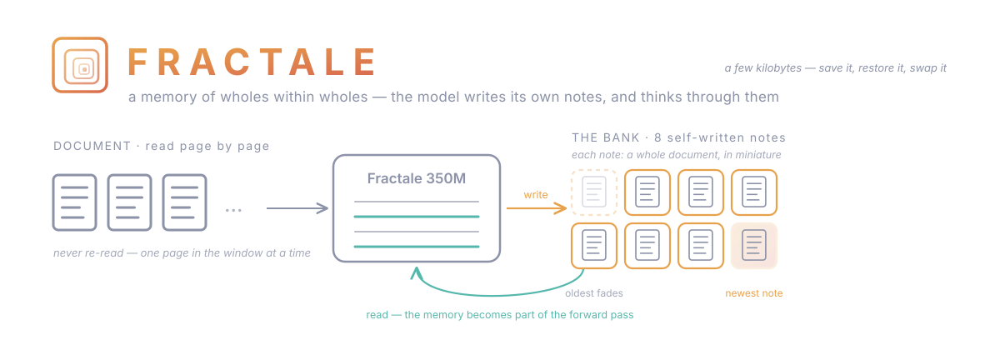

# Fractale



**Language models whose long-term memory is written by the model itself.**

A Fractale model reads a long document one page at a time and is allowed
**8 sticky notes**: after each page it writes one note *in its own learned
shorthand*; when the notes are full, the oldest is peeled off. It never
re-reads previous pages — everything it knows about what came before lives
on those 8 notes. The notes are not text: each one plugs back into the
network as a tiny piece of extra machinery (*fast weights*). The model
doesn't look at its memory, it **thinks through it**.

This repo is the **usage kit**: loading, reading, generating, and treating
the memory as a first-class object you can save, restore, reset, swap and
inspect. Inference differs from a classic LLM — you carry a bank state
across calls instead of a growing prompt — and this kit owns that loop.

- **Models:** [`fractale-lm/Fractale-350M-base`](https://huggingface.co/fractale-lm/Fractale-350M-base)
- **Paper** (mechanism, controls, baselines): [DOI 10.5281/zenodo.21225721](https://doi.org/10.5281/zenodo.21225721)
- **Public record** (preprint, pre-registered protocol): [kkuette/thought-bank](https://github.com/kkuette/thought-bank)

## Install

```bash
git clone https://github.com/fractale-lm/fractale-sdk && cd fractale-sdk
pip install -e .
```

## 60-second tour

```python
from fractale import BankSession

sess = BankSession.from_pretrained("fractale-lm/Fractale-350M-base")

# Read anything, any length — the bank accumulates, no growing prompt.
sess.read(open("mystery_novel_ch1-9.txt").read())

# What does the model expect next — from its 8 notes ALONE (blank input)?
print(sess.continuation(32))
print(sess.continuation(32, use_bank=False))   # amnesic control: the difference IS the memory

# The memory is a state you hold in your hand (a few kB).
sess.save_bank("novel.bank")        # persist today...
sess.reset()                        # ...clean slate...
sess.load_bank("novel.bank")        # ...restore tomorrow. The session survives the process.

print(sess.bank_stats())            # slot norms + similarities: what the memory physically is
```

## Demos

```bash
# Feed a file, then compare continuation with-memory vs amnesic vs ground truth
python scripts/read_document.py fractale-350m-base.pt some_file.py

# The memory transplant: same blank prompt, two banks — predictions follow the bank
python scripts/swap_banks.py fractale-350m-base.pt file_A.txt file_B.md
```

## What to expect (read this before judging it)

Fractale-350M-base is a **386M-parameter base model** (pretrained only, not
fine-tuned, no chat abilities). Its memory carries the **gist** of what it
read — domain, register, structure, announced facts — not a verbatim copy.
Expect the with-bank continuation to be *locked onto the right document and
style* while the amnesic control drifts generic; do not expect it to quote
line 3 word for word. Quantitatively the bank shifts the model's predictive
distribution by several nats on held-out documents (details and controls:
[the paper](https://doi.org/10.5281/zenodo.21225721)).

## Repo layout

```
fractale/
  session.py     ← BankSession: the chunk-feed / bank-carry loop, save/load/swap/inspect
  _core/         ← vendored inference modules, re-generated from a pinned export
scripts/         ← runnable demos
tools/           ← re-sync _core from its pinned export
```

## License

MIT. Built as an openly-stated human–AI collaboration (research direction:
kkuette; implementation and write-ups with Claude, Anthropic).
